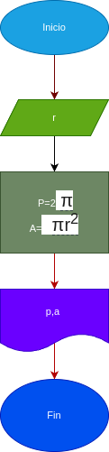

# Programa #1
Programa para calcular el area y el perimetro de un circulo de radia r

# Analisis

## Input 
### Variable de entrada
r: radio de ciculo
### Processing 
p:perimetro del circulo
p=2 πr

a: area del circulo 
a= πrr

### Output 
a,p
# Diseño

# Construccion

